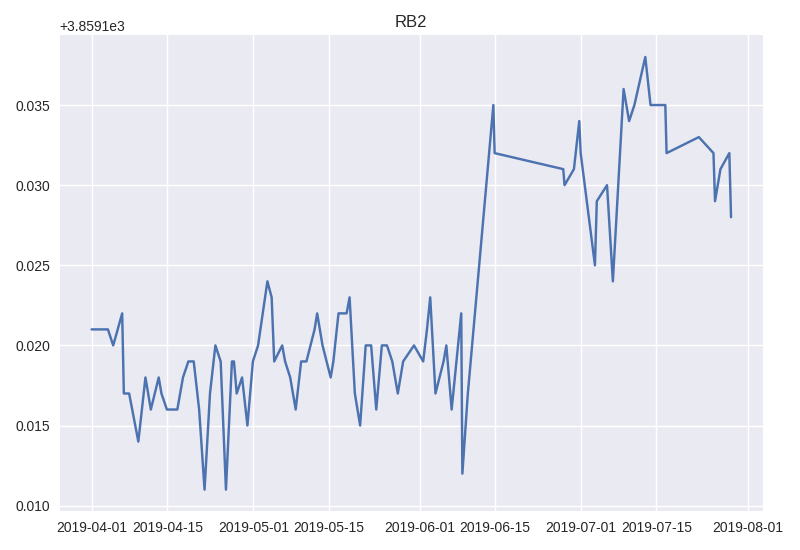
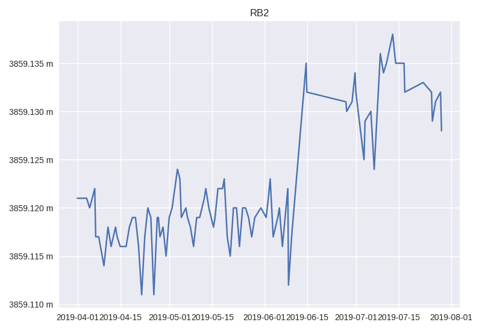

==============
Axis Formatter
==============

Axis formatter enable you to customize axis label. It is a wrapper of Matplotlib
tick formatting API. The formatter operates on a single tick value. Default
formatter that KomaPy uses is ``FormatStrFormatter``. See the following example
on how to use axis formatter in KomaPy chart.

Let's create a single EDM plot:

.. code-block:: python

    from komapy import Chart

    chart = Chart({
        'title': 'RB2',
        'theme': 'seaborn',
        'layout': {
            'data': [
                {
                    'series': [
                        {
                            'name': 'edm',
                            'query_params': {
                                'benchmark': 'BAB0',
                                'reflector': 'RB2',
                                'start_at': '2019-04-01',
                                'end_at': '2019-08-01',
                                'ci': True
                            },
                            'fields': ['timestamp', 'slope_distance'],
                            'xaxis_date': True
                        }
                    ]
                }
            ]
        }
    })

    chart.render()
    chart.save('figure.png')

Now add fomatter entry in the series config:

.. code-block:: python

    'formatter': {
        'y': {
            'major': {
                'format': '%.3f m'
            }
        }
    }

We format y axis major tick using 3 digit floating precission. The final
rendered image should look like as follows:

.. code-block:: python

    from komapy import Chart

    chart = Chart({
        'title': 'RB2',
        'theme': 'seaborn',
        'layout': {
            'data': [
                {
                    'series': [
                        {
                            'name': 'edm',
                            'query_params': {
                                'benchmark': 'BAB0',
                                'reflector': 'RB2',
                                'start_at': '2019-04-01',
                                'end_at': '2019-08-01',
                                'ci': True
                            },
                            'fields': ['timestamp', 'slope_distance'],
                            'xaxis_date': True,
                            'formatter': {
                                'y': {
                                    'major': {
                                        'format': '%.3f m'
                                    }
                                }
                            }
                        }
                    ]
                }
            ]
        }
    })

    chart.render()
    chart.save('figure.png')

If you want another formatter class, you can pass ``name`` field in the series
config and provides additional ``params`` (list) and ``keyword_params``
(dictionary) arguments. Most of Matplotlib axis formatter class will be
accepted. Here it is an example:

.. code-block:: python

    from komapy import Chart

    chart = Chart({
        'title': 'RB2',
        'theme': 'seaborn',
        'layout': {
            'data': [
                {
                    'series': [
                        {
                            'name': 'edm',
                            'query_params': {
                                'benchmark': 'BAB0',
                                'reflector': 'RB2',
                                'start_at': '2019-04-01',
                                'end_at': '2019-08-01',
                                'ci': True
                            },
                            'fields': ['timestamp', 'slope_distance'],
                            'xaxis_date': True,
                            'formatter': {
                                'y': {
                                    'major': {
                                        'name': 'StrMethodFormatter',
                                        'params': ['{x:.3f}'],
                                        'keyword_params': {

                                        }
                                    }
                                }
                            }
                        }
                    ]
                }
            ]
        }
    })

    chart.render()
    chart.save('figure.png')
