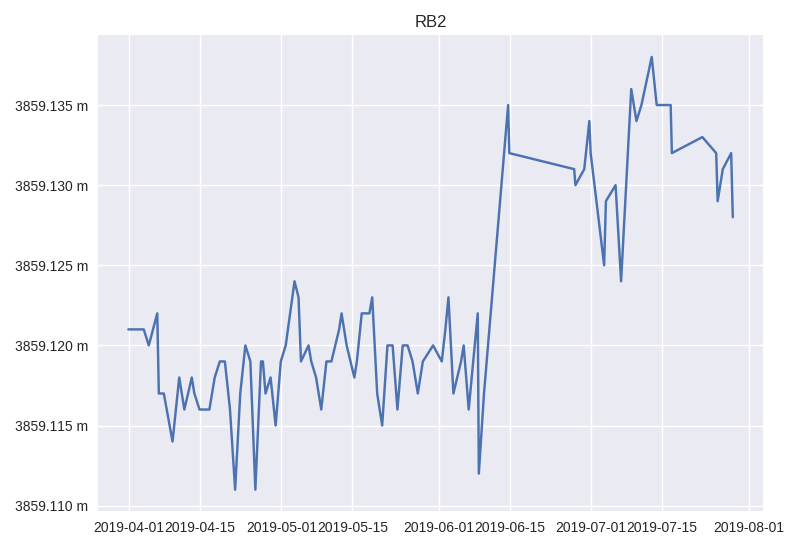
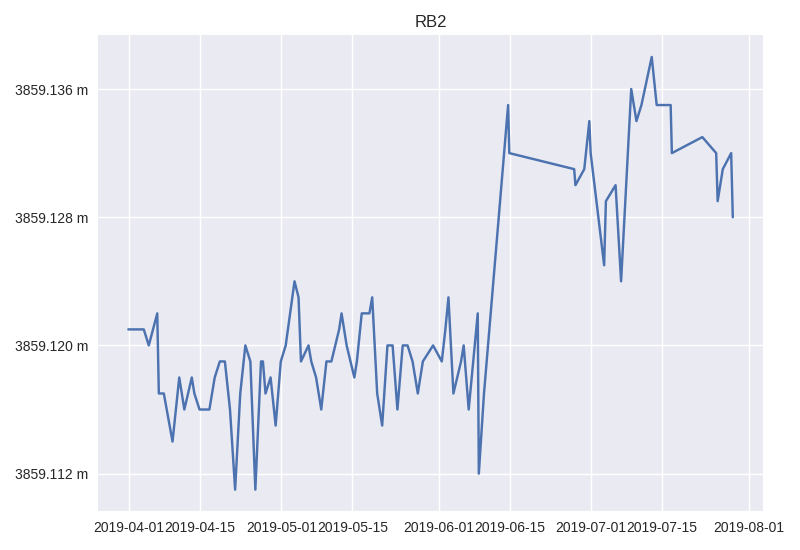

============
Axis Locator
============

Axis locator enable you to customize tick location. The locators handle
autoscaling of the view limits based on the data limits. Axis locator in KomaPy
act as a wrapper of Matplotlib tick locator API.

Let's create a single EDM plot as follows:

.. code-block:: python

    from komapy import Chart

    chart = Chart({
        'title': 'RB2',
        'theme': 'seaborn',
        'layout': {
            'data': [
                {
                    'series': [
                        {
                            'name': 'edm',
                            'query_params': {
                                'benchmark': 'BAB0',
                                'reflector': 'RB2',
                                'start_at': '2019-04-01',
                                'end_at': '2019-08-01',
                                'ci': True
                            },
                            'fields': ['timestamp', 'slope_distance'],
                            'xaxis_date': True,
                            'formatter': {
                                'y': {
                                    'major': {
                                        'format': '%.3f m'
                                    }
                                }
                            }
                        }
                    ]
                }
            ]
        }
    })

    chart.render()
    chart.save('figure.png')

Now add ``MaxNLocator`` locator to find up to a max number of intervals with
ticks at nice locations:

.. code-block:: python

    'locator': {
        'y': {
            'major': {
                'name': 'MaxNLocator',
                'params': [4],
                'keyword_params': {

                }
            }
        }
    }

Now final rendered image should look like as follows:

.. code-block:: python

    from komapy import Chart

    chart = Chart({
        'title': 'RB2',
        'theme': 'seaborn',
        'layout': {
            'data': [
                {
                    'series': [
                        {
                            'name': 'edm',
                            'query_params': {
                                'benchmark': 'BAB0',
                                'reflector': 'RB2',
                                'start_at': '2019-04-01',
                                'end_at': '2019-08-01',
                                'ci': True
                            },
                            'fields': ['timestamp', 'slope_distance'],
                            'xaxis_date': True,
                            'formatter': {
                                'y': {
                                    'major': {
                                        'format': '%.3f m'
                                    }
                                }
                            },
                            'locator': {
                                'y': {
                                    'major': {
                                        'name': 'MaxNLocator',
                                        'params': [4],
                                        'keyword_params': {

                                        }
                                    }
                                }
                            }
                        }
                    ]
                }
            ]
        }
    })

    chart.render()
    chart.save('figure.png')

You can set other Matplotlib axis locator class and set ``params`` and
``keyword_params`` fields.
