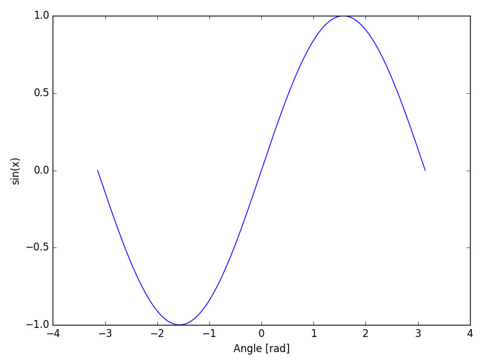

==============
Extending Plot
==============

In some situations, you may want to extend and customize axis for advanced
usage. KomaPy provides several a way to accommodate them. You can extend plot
using a function with current axis as an argument and return the axis. Here it
is an example of extending plot using function:

.. code-block:: python

    import numpy as np
    from komapy import Chart

    def sin_series(axis):
        """
        Plot sin function series.
        """
        x = np.linspace(-np.pi, np.pi, 201)
        y = np.sin(x)

        axis.plot(x, y)
        axis.set_xlabel('Angle [rad]')
        axis.set_ylabel('sin(x)')

        return axis

    chart = Chart({
        'layout': {
            'data': [
                {
                    'series': [
                        {
                            'fields': sin_series
                        }
                    ]
                }
            ]
        }
    })

    chart.render()
    chart.save('figure.png')

Instead of setting the fields value as a list, we assign the fields as a
function that takes current axis as the argument. You can plot any data on that
axis, and customize the axis according to your need.
