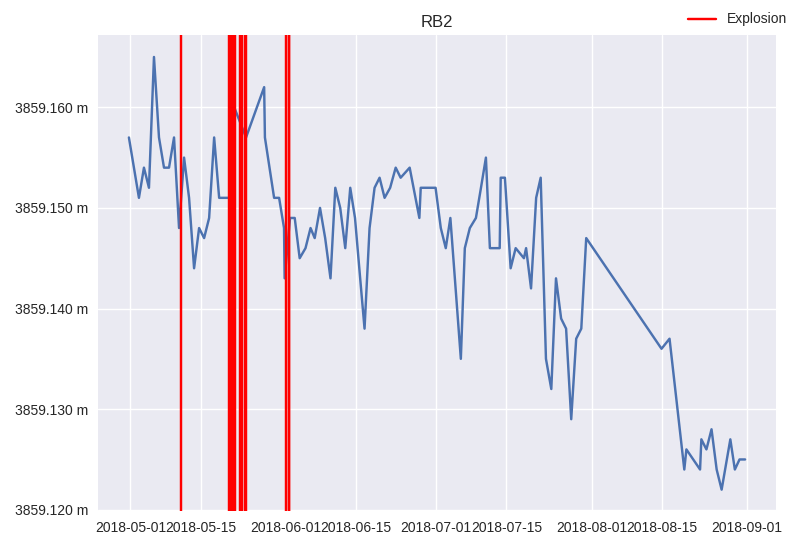

==============
Extension Plot
==============

Extension plot is a feature provided by KomaPy to accommodate non-series data
plot in a chart object. One example is to plot vertical axis line indicating
explosion event. Another example is to plot other data that should be drawn on
each subplot figures, so you don't have to write chart config in each series.

The following demonstrate on how to use extension plot to drawn vertical axis
line indicating explosion line:

.. code-block:: python

    from komapy import Chart

    chart = Chart({
        'title': 'RB2',
        'theme': 'seaborn',
        'layout': {
            'data': [
                {
                    'series': [
                        {
                            'name': 'edm',
                            'query_params': {
                                'benchmark': 'BAB0',
                                'reflector': 'RB2',
                                'start_at': '2018-05-01',
                                'end_at': '2018-09-01',
                                'ci': True
                            },
                            'fields': ['timestamp', 'slope_distance'],
                            'xaxis_date': True,
                            'formatter': {
                                'y': {
                                    'major': {
                                        'format': '%.3f m'
                                    }
                                }
                            }
                        }
                    ]
                }
            ]
        },
        'extensions': {
            'starttime': '2018-05-01',
            'endtime': '2018-09-01',
            'plot': [
                {
                    'name': 'explosion',
                    'label': 'Explosion',
                    'color': 'red'
                },
            ],
            'legend': {
                'show': True,
                'loc': 'upper right'
            }
        }
    })

To make extension plot you need to set ``starttime`` and ``endtime`` fields. It
indicates on what time range an explosion lines are drawn. Extension plot entry
is added in ``plot`` field. Each entry has at least ``name`` field. It could be
a string of built-ins extension plot functions or callable function if you want
to build your own extension plot. Other parameters can be set like ``label``,
``color``, etc.

If you want to create your own extension plot, you can assign ``name`` field to
some callable function. First, write a custom extension plot function:

.. code-block:: python

    def custom_extension_plot(axis, starttime, endtime, **options):
        """
        Custom extension plot.
        """
        handle = axis.plot(...)

        return handle

Then register the function into the extension chart config:

.. code-block:: python

    'extensions': {
        'starttime': '2018-05-01',
        'endtime': '2018-09-01',
        'plot': [
            {
                'name': custom_extension_plot
                'label': 'My custom label'
            }
        ],
    }

Another way to register custom extension plot is using KomaPy built-ins
extension register helper:

.. code-block:: python

    from komapy.extensions import register_extension

    register_extension('custom_extension', custom_extension_plot, **kwargs)

Then, in the extension chart config, you can access your custom extension plot
by its registered name:

.. code-block:: python

    'extensions': {
        'starttime': '2018-05-01',
        'endtime': '2018-09-01',
        'plot': [
            {
                'name': 'custom_extension',
                'label': 'My custom label'
            }
        ],
    }

You can also register your own extension function using decorator. For example:

.. code-block:: python

    from komapy.extensions import register_extension

    register_extension('custom_extension')
    def custom_extension_plot(axis, starttime, endtime, **options):
        """
        Custom extension plot.
        """
        handle = axis.plot(...)

        return handle
