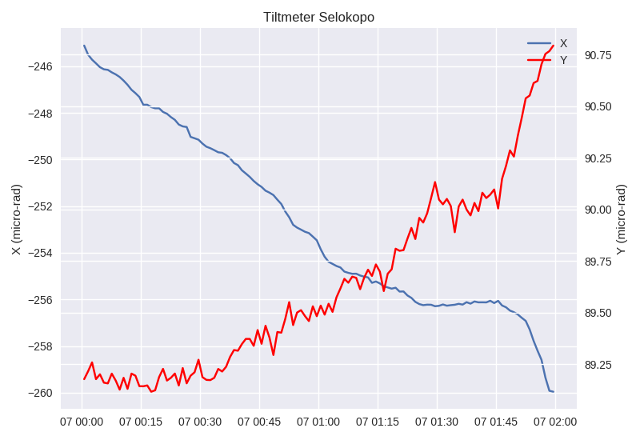

===============
Multiple Series
===============

Creating multiple series in one plot is easy. You can define them in layout
data ``series`` field. See the following example:

.. code-block:: python

    from komapy import Chart

    chart = Chart({
        'title': 'Tiltmeter Selokopo',
        'theme': 'seaborn',
        'layout': {
            'data': [
                {
                    'series': [
                        # Series 1
                        {
                            'name': 'tiltmeter',
                            'query_params': {
                                'station': 'selokopo',
                                'timestamp__gte': '2019-06-07 07:00:00',
                                'timestamp__lt': '2019-06-07 09:00:00',
                                'nolimit': True
                            },
                            'plot_params': {
                                'label': 'X'
                            },
                            'fields': ['timestamp', 'x'],
                            'xaxis_date': True,
                            'labels': {
                                'y': {
                                    'text': 'X (micro-rad)',
                                }
                            }
                        },

                        # Series 2
                        {
                            'name': 'tiltmeter',
                            'query_params': {
                                'station': 'selokopo',
                                'timestamp__gte': '2019-06-07 07:00:00',
                                'timestamp__lt': '2019-06-07 09:00:00',
                                'nolimit': True
                            },
                            'plot_params': {
                                'color': 'red',
                                'label': 'Y'
                            },
                            'fields': ['timestamp', 'y'],
                            'xaxis_date': True,
                            'secondary': 'x',
                            'labels': {
                                'y': {
                                    'text': 'Y (micro-rad)',
                                }
                            }
                        }
                    ],

                    'legend': {
                        'show': True,
                        'loc': 'upper right'
                    }
                }
            ]
        }
    })

    chart.render()
    chart.save('figure.png')

Series config has similar structure, so you can add or remove them easily.
Series config in the matplotlib realm represent a ``axis`` instance. KomaPy
wraps it to enable easy configuration. You can even extend its functionality
using callable function.

Note that the ``legend`` field is placed on the same block as ``series`` field.
It tells KomaPy that the legend is built for all series instead of individual
series. If you place the ``legend`` field within the ``series`` field, the
legend will overlap to each other.

Field ``secondary`` tells KomaPy to which axis it should plot the series. If
value is None or not set, the series is plotted on primary axis. If the value
equal to ``x``, the series is plotted on secondary x axis. Similarly, if the
value equal to ``y``, the series is plotted on secondary y axis.
