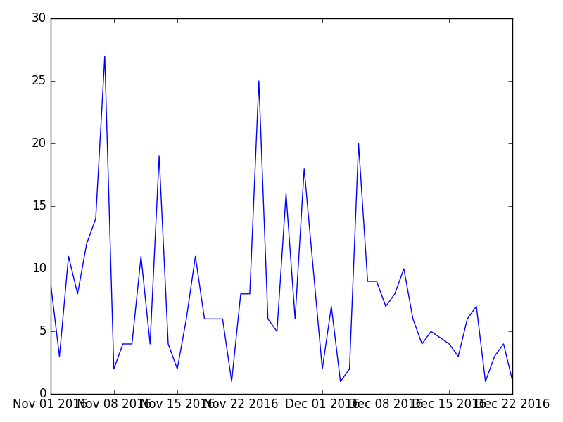

===========
Quick Start
===========

Let's create an chart using KomaPy chart engine:

.. code-block:: python

    from komapy import Chart

    chart = Chart({
        # Write config in here.
    })

    chart.render()
    chart.save('figure.png')

This will create empty figure named ``figure.png``. Now let's add a chart series
to plot ``seismicity`` data:

.. code-block:: python

    from komapy import Chart

    chart = Chart({
        'layout': {
            'data': [
                {
                    'series': [
                        {
                            'name': 'seismicity',
                            'fields': ['timestamp', 'count'],
                            'xaxis_date': True
                        }
                    ]
                }
            ]
        }
    })

    chart.render()
    chart.save('figure.png')

Now let change plot type to ``bar`` plot, and add filter to plot data only on
time range between ``2019-05-01`` and ``2019-08-01``, and event type equal to
``ROCKFALL``:

.. code-block:: python

    from komapy import Chart

    chart = Chart({
        'layout': {
            'data': [
                {
                    'series': [
                        {
                            'type': 'bar',
                            'name': 'seismicity',
                            'query_params': {
                                'eventdate__gte': '2019-05-01',
                                'eventdate__lt': '2019-08-01',
                                'eventtype': 'ROCKFALL',
                                'nolimit': True
                            },
                            'fields': ['timestamp', 'count'],
                            'xaxis_date': True
                        }
                    ]
                }
            ]
        }
    })

    chart.render()
    chart.save('figure.png')

You can add another property like title, labels, theme, etc. You can see on the
example below:

.. code-block:: python

    from komapy import Chart

    chart = Chart({
        'title': 'ROCKFALL',
        'theme': 'seaborn',
        'layout': {
            'data': [
                {
                    'series': [
                        {
                            'type': 'bar',
                            'name': 'seismicity',
                            'query_params': {
                                'eventdate__gte': '2019-05-01',
                                'eventdate__lt': '2019-08-01',
                                'eventtype': 'ROCKFALL',
                                'nolimit': True
                            },
                            'fields': ['timestamp', 'count'],
                            'xaxis_date': True,
                            'labels': {
                                'y': {
                                    'text': 'count/day',
                                }
                            }
                        }
                    ]
                }
            ]
        }
    })

    chart.render()
    chart.save('figure.png')

