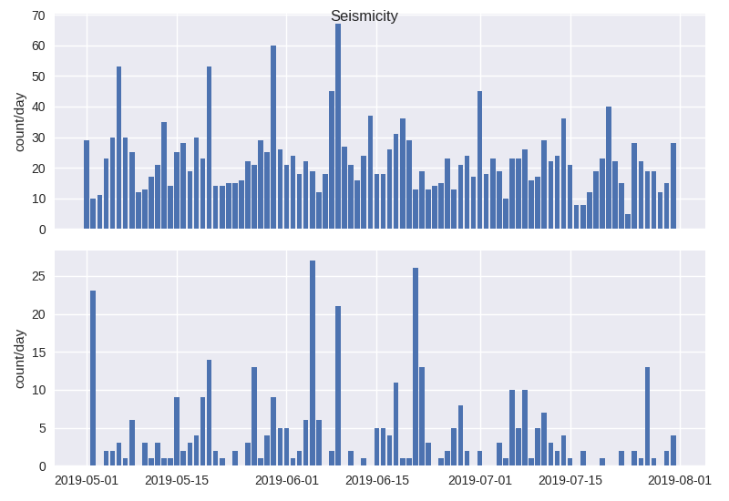
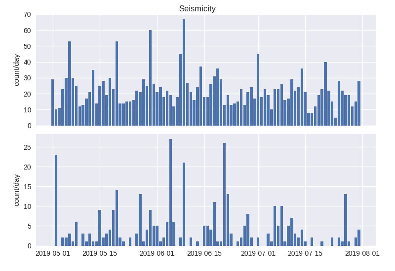
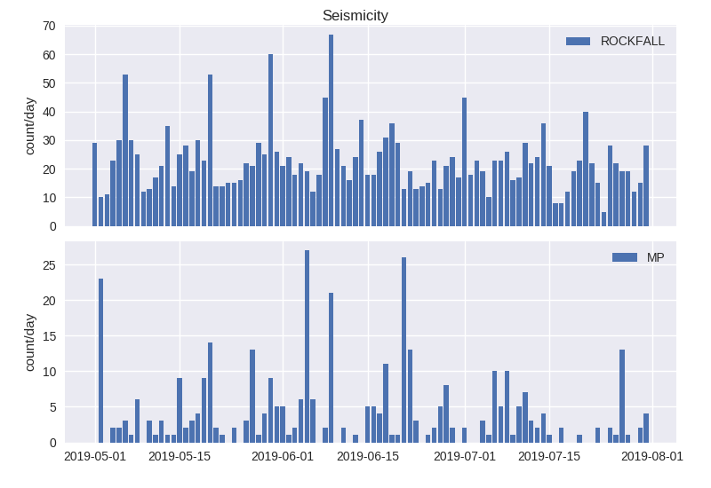

========
Subplots
========

In the previous section you have created a chart with single plot figure. In
this section we will learn on how to make a chart with multiple plot figures.
Let's see the example below:

.. code-block:: python

    from komapy import Chart

    chart = Chart({
        'title': 'Seismicity',
        'theme': 'seaborn',
        'layout': {
            'options': {
                'sharex': True
            },
            'data': [
                # Figure 1
                {
                    'series': [
                        {
                            'type': 'bar',
                            'name': 'seismicity',
                            'query_params': {
                                'eventdate__gte': '2019-05-01',
                                'eventdate__lt': '2019-08-01',
                                'eventtype': 'ROCKFALL',
                                'nolimit': True
                            },
                            'fields': ['timestamp', 'count'],
                            'xaxis_date': True,
                            'labels': {
                                'y': {
                                    'text': 'count/day',
                                }
                            },
                        }
                    ]
                },

                # Figure 2
                {
                    'series': [
                        {
                            'type': 'bar',
                            'name': 'seismicity',
                            'query_params': {
                                'eventdate__gte': '2019-05-01',
                                'eventdate__lt': '2019-08-01',
                                'eventtype': 'MP',
                                'nolimit': True
                            },
                            'fields': ['timestamp', 'count'],
                            'xaxis_date': True,
                            'labels': {
                                'y': {
                                    'text': 'count/day',
                                }
                            },
                        }
                    ]
                },
            ]
        }
    })

    chart.render()
    chart.save('figure.png')

As you can see in the example above, you can make a subplot by adding one or
more entry in the layout data. Each entry has similar structure. So it is easy
to add or remove subplot figure. Layout options ``sharex`` tells KomaPy that the
axes are shared on x, so the x axis tick label only drawn on the last axis.

You can see that the plot title is overlapping with plot area. You can fix that
by adding ``tight_layout`` property:

.. code_block:: python

    from komapy import Chart, set_api_key

    chart = Chart({
        'title': 'Seismicity',
        'theme': 'seaborn',
        'tight_layout': {
            'pad': 2,
            'w_pad': 0.5,
            'h_pad': 0.6
        },
        'layout': {
            'options': {
                'sharex': True
            },
            'data': [
                # Figure 1
                {
                    'series': [
                        {
                            'type': 'bar',
                            'name': 'seismicity',
                            'query_params': {
                                'eventdate__gte': '2019-05-01',
                                'eventdate__lt': '2019-08-01',
                                'eventtype': 'ROCKFALL',
                                'nolimit': True
                            },
                            'fields': ['timestamp', 'count'],
                            'xaxis_date': True,
                            'labels': {
                                'y': {
                                    'text': 'count/day',
                                }
                            },
                        }
                    ]
                },

                # Figure 2
                {
                    'series': [
                        {
                            'type': 'bar',
                            'name': 'seismicity',
                            'query_params': {
                                'eventdate__gte': '2019-05-01',
                                'eventdate__lt': '2019-08-01',
                                'eventtype': 'MP',
                                'nolimit': True
                            },
                            'fields': ['timestamp', 'count'],
                            'xaxis_date': True,
                            'labels': {
                                'y': {
                                    'text': 'count/day',
                                }
                            },
                        }
                    ]
                },
            ]
        }
    })

    chart.render()
    chart.save('figure.png')

Final step is to add legend on each subplot figures:

.. code-block:: python

    from komapy import Chart

    chart = Chart({
        'title': 'Seismicity',
        'theme': 'seaborn',
        'tight_layout': {
            'pad': 2,
            'w_pad': 0.5,
            'h_pad': 0.6
        },
        'layout': {
            'options': {
                'sharex': True
            },
            'data': [
                # Figure 1
                {
                    'series': [
                        {
                            'type': 'bar',
                            'name': 'seismicity',
                            'query_params': {
                                'eventdate__gte': '2019-05-01',
                                'eventdate__lt': '2019-08-01',
                                'eventtype': 'ROCKFALL',
                                'nolimit': True
                            },
                            'fields': ['timestamp', 'count'],
                            'xaxis_date': True,
                            'labels': {
                                'y': {
                                    'text': 'count/day',
                                }
                            },
                            'plot_params': {
                                'label': 'ROCKFALL'
                            },
                            'legend': {
                                'show': True,
                                'loc': 'upper right'
                            }
                        }
                    ]
                },

                # Figure 2
                {
                    'series': [
                        {
                            'type': 'bar',
                            'name': 'seismicity',
                            'query_params': {
                                'eventdate__gte': '2019-05-01',
                                'eventdate__lt': '2019-08-01',
                                'eventtype': 'MP',
                                'nolimit': True
                            },
                            'fields': ['timestamp', 'count'],
                            'xaxis_date': True,
                            'labels': {
                                'y': {
                                    'text': 'count/day',
                                }
                            },
                            'plot_params': {
                                'label': 'MP'
                            },
                            'legend': {
                                'show': True,
                                'loc': 'upper right'
                            }
                        }
                    ]
                },
            ]
        }
    })

    chart.render()
    chart.save('figure.png')

